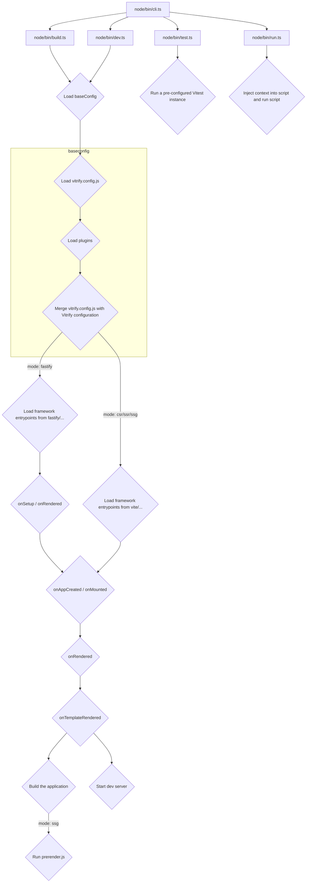

# Vitrify

## Commands

### build

```
Usage:
  $ vitrify build

Options:
  -m, --mode [mode]            Build mode (default: csr)
  --base [base]                Base public path
  --outDir [outDir]            Output directory
  --appDir [appDir]            App directory
  --publicDir [publicDir]      Public directory
  --productName [productName]  Product name
  -h, --help                   Display this message
```

### dev

```
Usage:
  $ vitrify dev

Options:
  -m, --mode [mode]        Development server mode (default: csr)
  --host [host]            Specify which IP addresses the server should listen on (default: 127.0.0.1)
  --appDir [appDir]        Application directory
  --publicDir [publicDir]  Public directory
  -h, --help               Display this message
```

### test

```
Usage:
  $ vitrify test

Options:
  -h, --help  Display this message
```

### run

```
Usage:
  $ vitrify run <file>

Options:
  -h, --help  Display this message
```

## Structure


