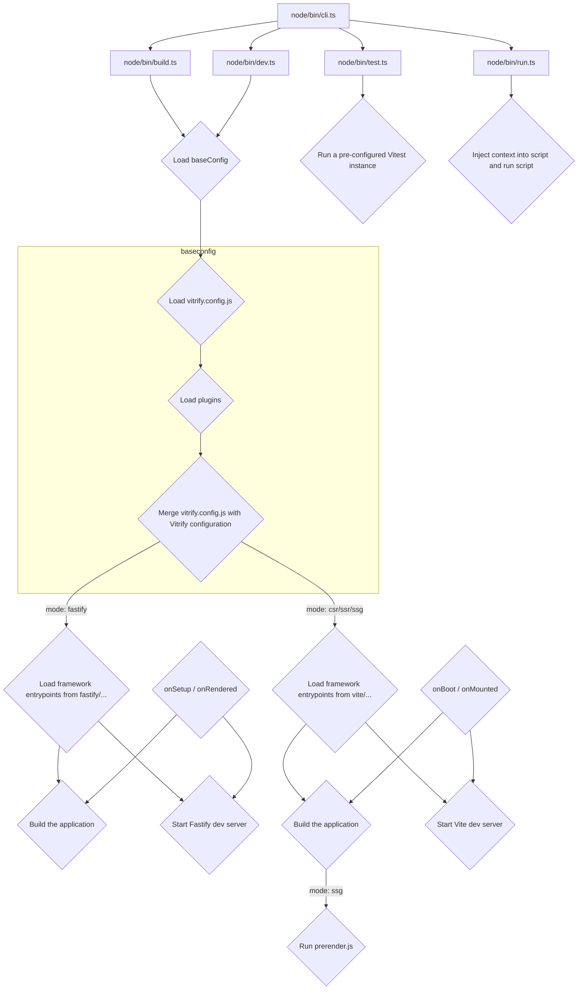

# Vitrify

> Vite as your Full Stack development tool

- Use a simple configuration file to configure and integrate required Vite plugins into your project.
- Client-Side Rendering (CSR), Server-Side Rendering (SSR), Static Site Generation (SSG) and Fastify server build and development modes.
- Run both your frontend- and backend code through Vite at development and build time.

## Features

- Uses [Fastify](https://github.com/fastify/fastify-vite) for the development server and SSR production server.
- Generates a Fastify plugin to serve your server-side rendered application.
- A [`run`](./src/node/bin/run.ts) command which injects context such as application paths into the script which you want to run.
- A [`test`](./src/node/bin/test.ts) command which runs a pre-configured [Vitest](https://github.com/vitest-dev/vitest) instance.
- An [extra plugin layer](./src/node/plugins/index.ts) which provides some extra context such as the SSR mode (client or server) and PWA mode. Used for UI frameworks which render differently based on these settings.

## Commands

### build

```
Usage:
  $ vitrify build

Options:
  -m, --mode [mode]            Build mode (default: csr)
  --base [base]                Base public path
  --outDir [outDir]            Output directory
  --appDir [appDir]            App directory
  --publicDir [publicDir]      Public directory
  --productName [productName]  Product name
  -h, --help                   Display this message
```

### dev

```
Usage:
  $ vitrify dev

Options:
  -m, --mode [mode]        Development server mode (default: csr)
  --host [host]            Specify which IP addresses the server should listen on (default: 127.0.0.1)
  --appDir [appDir]        Application directory
  --publicDir [publicDir]  Public directory
  -h, --help               Display this message
```

### test

```
Usage:
  $ vitrify test

Options:
  -h, --help  Display this message
```

### run

```
Usage:
  $ vitrify run <file>

Options:
  -h, --help  Display this message
```

## Structure


